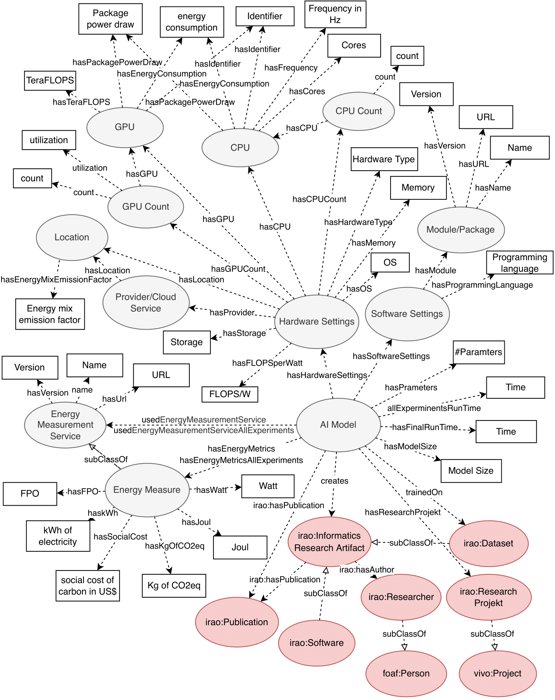

# The Energy Measurement of AI Models Ontology
Modeling AI systems' characteristics of energy consumption and their sustainability level as an extension of the FAIR data principles has been considered only rudimentarily. In this work, we propose an **ontology for modeling the energy consumption and other environmental aspects of AI models**. The ontology can be used in various scenarios, ranging from an improved research data management to strategic controlling of institutions and the implementation of standards. 

Our ontology (OWL file) is available at **http://w3id.org/EMAI/ontology**

The ontology was evaluated based on the competency questions given below.

You can use the following Microsoft Forms to provide your information about your AI model's energy consumption. This will successively increase our knowledge graph and add the data to the Linked Open Data Cloud: **https://forms.office.com/r/HYd4R9jutX**

[emai knowledge graph](emai-knowledge-graph)

# Schema


# Competency Questions
* Q1: How many floating-point operations (FPO) did the AI Model need to be trained?
* Q2: How much kg of CO2eq did the AI Model generate?
* Q3: How long did it take to train the AI Model?
* Q4: How much energy in kWh did the training of the AI model take?
* Q5: What Energy Measurement Services are used to calculate metrics about the AI Model's energy consumption?
* Q6: What energy metrics are used to indicate the energy consumption of an AI Model?
* Q7: How many times was the metric "floating-point operations" (FPO) used to indicate the energy consumption of AI models?
* Q8: What are the hardware settings used for training the AI Model?
* Q9: In which region is the hardware used to train the AI Model? (Background: In a carbon-friendly region?)
* Q10: Which provider (cloud service) was used to train the AI Model?
* Q11: Did AI Model A or AI Model B generate more CO2?
* Q12: Which programming language was used to train the AI Model?
* Q13: What software modules were used to train the AI Model?
* Q14: In the context of which research project was the AI Model developed?
* Q15: Which publication does the AI Model have?

# Usage

```sparql
# get the number of floating-point operations (FPO) that were needed to train the AI models.
# answers Q1
```


```sparql
# get several energy metrics that specify the energy consumption of an AI Model
# answers Q2, Q3 and Q4
```


```sparql
# get infomations about which Energy Measurement Services are used
# answers Q5
PREFIX emai: <https://w3id.org/EMAI/>

SELECT * WHERE {
	?aiModel a emai:AIModel .
	?aiModel emai:usedEnergyMeasurementService ?emService .
	?emService emai:hasName ?emServiceName .
}
```

```sparql
# get informations about which Energy Measurement Metrics are used
# answers Q6
PREFIX emai: <https://w3id.org/EMAI/>

SELECT DISTINCT(?emMetric)
WHERE {
	?aiModel a emai:AIModel .
	?aiModel emai:hasEnergyMetrics ?energyMetrics .
	?energyMetrics ?emMetric ?emMetricValue .
}
```

```sparql
# get the total number how often the metric floating-point operations (FPO) is used
# answers Q7
PREFIX emai: <https://w3id.org/EMAI/>

SELECT (COUNT(?floatingPointOperations) as ?totalNumberFPO)
WHERE { 
	?aiModel a emai:AIModel .
  	?aiModel emai:hasEnergyMetrics ?energyMetrics .
  	?energyMetrics emai:hasFPO ?floatingPointOperations . 
} 
```

```sparql
# get several information about the hardware used to train an AI Model
# answers Q8, Q9 and Q10
PREFIX emai: <https://w3id.org/EMAI/>

SELECT * WHERE {
	?aiModel a emai:AIModel .
	?aiModel emai:hasHardwareSettings ?hardwareSettings .
	OPTIONAL {
	  	?hardwareSettings emai:hasHardwareType ?hardwareType .
		?hardwareSettings emai:hasMemory ?memory .
		?hardwareSettings emai:hasLocation ?location .
		?hardwareSettings emai:hasProvider ?provider .
	}
}
```

```sparql
# compare two AI Models
# answers Q11
PREFIX emai: <https://w3id.org/EMAI/>

SELECT * WHERE {
	?aiModel1 a emai:AIModel .
	?aiModel2 a emai:AIModel .
	OPTIONAL {
		?aiModel1 emai:hasEnergyMetrics ?energyMetrics1 .
		?aiModel2 emai:hasEnergyMetrics ?energyMetrics2 .
		?energyMetrics1 emai:hasFPO ?floatingPointOperations1 .
		?energyMetrics2 emai:hasFPO ?floatingPointOperations2 .
	}
}
```

```sparql
# get several information about the software used to train an AI Model
# answers Q12 and Q13
PREFIX emai: <https://w3id.org/EMAI/>

SELECT * WHERE {
	?aiModel a emai:AIModel .
	?aiModel emai:hasSoftwareSettings ?softwareSettings .
	OPTIONAL {
		?softwareSettings emai:hasProgrammingLanguage ?programmingLanguage .
		?softwareSettings emai:hasModule ?module .
		?module emai:hasName ?moduleName .
	}
}
```

```sparql
# get several information about Publications and Research Projects related to the AI Models
# answers Q14 and Q15
PREFIX emai: <https://w3id.org/EMAI/>
PREFIX irao: <http://ontology.ethereal.cz/irao/>

SELECT * WHERE {
	?aiModel a emai:AIModel .
	?aiModel irao:hasPublication ?relatedPublication .
	?aiModel irao:hasResearchProject ?researchProject .
}
```

# Related Work
The following papers have been considered for creating the ontology (ranked by decreasing citation count):


